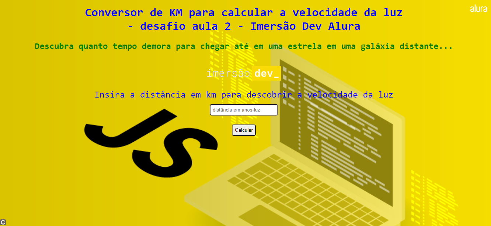

Desafio do segundo dia da Imersão Dev da Alura em que calcula em KM para a velocidade da luz para chegar em uma determinada estrela em uma galáxia distante...

Tecnologias usadas: HTML5, CSS3 e JavaScript

